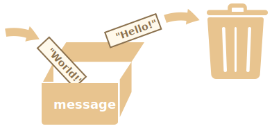

# Cheatsheet :
This is a cheatsheet for FormationFromParis !

# Table of contents :

I. [Javascript, basics](#I.-Javascript,-basics)
1. [Variables](#1-variables)
2. [Variables Types](#2-variables-types)
3. [Comparisons](#3-comparisons)
4. [Conditional if/else and ternary](#4-conditional-ifelse-and-ternary)
5. [Logical Operators](#5-logical-operators)
6. [Loops, while and for](#6-loops-while-and-for)
7. [Arrays](#7-arrays)
8. [Objects](#8-objects)
9. [Functions](#9-functions)

# I. Javascript, basics
## 1. Variables
### a. Syntax

A variable is like a box you can put anything in to use it :


There are 3 ways to declare a variable :

```js
const message = 'Hello!';
```

```js
let message = 'Hello!';
```

```js
var message = 'Hello!';
```

You can't declare a variable twice with the same name :
```js
const message = 'Hello!';
let message = 'World!'; // This will trigger an error
```
Variables are case sensitives `message` and `messageE` are not the same :
```js
const message = 'Hello!';
let messagE = 'World!'; // This is OK, it's not the same variable name

console.log(message); // output => Hello!
console.log(messagE); // output => Wolrd!
```
😍 `const` syntax means that the variable content can't be changed.
```js
const message = 'Hello!';
message = 'World!'; // This will trigger an error
```

😀 `let` syntax means that the variable content can be changed.
```js
let message = 'Hello!';
console.log(message); // output => Hello!

message = 'World!'; // This is OK
console.log(message); // output => World!

// You can also put the content of another variable in message :
const anotherMessage = 'Hello World!';
message = anotherMessage;
console.log(message); // output => Hello World!
```



😠 `var` syntax is an old way to declare variables, you shouldn't use it but you'll sometimes find it on the internet. It is mostly like `let`. 

### b. Naming convention

Variables names can contain letters and numbers but must start with a letter and by convention in [camelCase](https://fr.wikipedia.org/wiki/Camel_case) :

```js
let variable; // OK
let myMessage; // OK
let myMessage42; // OK

let myMeSSage; // WRONG, it works but not recommended
let MyMessage; // WRONG, it works but not recommended, this is named PascalCase
let 2message; // WRONG, will not work !
```

## 2. Variables Types
### a. Number

```js
const myNumber = 42; 
const myDecimalNumber = 42.42; 
```
You can use operations on numbers.
```js
const myNumber = 42;

console.log(myNumber + 2); // output => 44 
console.log(myNumber - 2); // output => 40 
console.log(42 * 2); // output => 84 
console.log(42 / 2); // output => 21
console.log(3 ** 3); // output => 27 (this is the pow operaion) 
```
There are some weird exceptions.
```js
console.log(42 / 0); // output => Infinity
console.log('Any string' / 2); // output => NaN
```
`NaN` means "not a number". Note that those operations won't trigger an error.

The global Math library allows you to make some handy operations.
```js
const rounded = Math.round(10.5); // (round the decimal number)
console.log(rounded); // output => 11

console.log(Math.round(10.4)); // output => 10
console.log(Math.floor(10.9)); // output => 10 (always round down)
console.log(Math.ceil(10.1)); // output => 11 (always round up)
console.log(Math.abs(-10)); // output => 10 (absolute value)
console.log(Math.random()); // output => 0.XXXXX (returns a random value between 0 included and 1 excluded);
console.log(Math.max(4, -2, 8)); // output => 8 (returns the max of provided values);
console.log(Math.min(4, -2, 8)); // output => -2 (returns the min of provided values);
```

### b. String

There are 3 ways to declare a string :
```js
const doubleQuoteString = "Double quote"; // Works but Not recommended !
const singleQuoteString = 'Single quote'; // Recommended !
const backticksString = `Backtick`;
```

The "Backtick" is very used to concatenate strings :
```js
const chickenString = 'chicken';
const rabbitString = 'rabbit';

console.log(`I am a ${chickenString}.`); // output => I am a chicken.
console.log(`I am a ${rabbitString}.`); // output => I am a rabbit.
```

Using `+` symbol with strings will concatenate them. Used between numbers and strings will considerate the number as a string.
```js
const chocolateString = 'chocolate';

console.log('I love ' + chocolateString + '.'); // output => I love chocolate.
console.log('I ate ' + 10 + ' ' + chocolateString + 's.'); // output => I ate 10 chocolates.
```
A string always comes with his length.
```js
const chocolateString = 'chocolate';
console.log(chocolateString.length); // output => 9
console.log('yes'.length); // output => 3
console.log(''.length); // output => 0
```
You can transform a string to a number.
```js
const numberedString = '42';
console.log(Number(numberedString)); // output => 42 (as a number)
console.log(Number('42AAA')); // output => NaN
console.log(+numberedString); // output => 42 (as a number)
console.log(+'42AAA'); // output => NaN
console.log(parseInt(numberedString)); // output => 42 (as a number)
console.log(parseInt('42AAA')); // output => 42 (as a number)
console.log(parseInt('42.42AAA')); // output => 42 (as a number)
console.log(parseFloat('42.42AAA')); // output => 42.42 (as a number)
```

Note that if you need to use a single quote in a string, you have to "escape" it with a `\` (backslash).
```js
console.log('it's not working'); // WRONG, it's not working

console.log('it\'s working!'); // GOOD, output => it's working!
```

### c. Boolean
```js
const isTrue = true;
const isFalse = false;

// comparison will also create a boolean value
console.log(42 > 21); // output => true
console.log(42 < 21); // output => false
```
More details on comparison in [logical section](#3-comparisons).

### d. "undefined"
`undefined` is a special type.
```js
const undefinedVariable = undefined;
let undefinedVariable2;

console.log(undefinedVariable); // output => undefined
console.log(undefinedVariable2); // output => undefined
```
`undefined` means the value hasn't been defined.

### d. Array and Objects
Described in their own sections: [Array](#7-arrays) and [Objects](#8-objects)

## 3. Comparisons
```js
a > b; // Greater than
a < b; // Lower than
a >= b; // Greater than equal
a <= b; // Lower than equal

a == b; // Equal (Not recommended)
a === b; // Strictly equals (Recommended)
```
Examples.
```js
console.log(4 > 2); // output => true
console.log(4 < 2); // output => false

console.log(4 >= 2); // output => true
console.log(4 >= 4); // output => true

console.log(4 == 4); // output => true
console.log(4 === 4); // output => true
```
With strings (it is alphabetical comparison).
```js
console.log('boys' > 'girls'); // output => false
console.log('Boys' < 'Girls'); // output => true

// Be carefull of casing, uppercase comes first
// => 'b' is greater than 'a' but 'B' is lower than 'a' 
console.log('boys' > 'Girls'); // output => true
console.log('boys' < 'Girls'); // output => false
```
With differents types.
```js
console.log('1' == 1); // output => true
console.log('1' === 1); // output => false

console.log(true == 1); // output => true
console.log(true === 1); // output => false

console.log(false == 0); // output => true
console.log(false === 0); // output => false
```
Note that strict equality compares also the type and is more accurate. That's why you should always use `===` over `==`.

## 4. Conditional if/else and ternary
### a. "if" statement
```js
if (true) {
  console.log('Yes it is true.');
  console.log('Another statement.');
}
// output => Yes it is true.
// output => Another statement.
```

```js
if (false) {
  console.log('No it is false');
}
// no output =(
```
Note that you can put as many statement you want between the "brackets" (=> opening bracket `{` and closing bracket `}`)

The "condition" to execute the code between the brackets can be any "truthy" value, in the case of a "falsy" value the code won't be executed
```js
let condition;
// examples of truthy values :
// condition = true;
// condition = 'not empty string';
// condition = 42; // not zero number
// condition = 42 > 2;

if (condition) {
  console.log('That is true, it is a truthy value !')
}
// output => That is true, it is a truthy value !

// examples of falsy values :
// condition = false;
// condition = '';
// condition = 0;
// condition = 42 < 2;

if (condition) {
  console.log('That is false, it is a falsy value !')
}
// no output =(
```

### b. "else" statement
The `else` statement must always be used after an `if` and will execute the code between the bracket only if the `if` condition is falsy.

```js
if ('girls' > 'boys') {
  console.log('Life is fair =)');
} else {
  console.log('Life is unfair =(');
}
// output => Life is fair =)


if (false) {
  console.log('Execute if');
} else {
  console.log('Execute else');
}
// output => Execute else
```

### c. "else if" statement

```js
const day = 'sunday';

if (day === 'monday') {
  console.log('I am sad =(');
} else if (day === 'sunday') {
  console.log('I am happy =)');
} else {
  console.log('I am ok ..');
}

// output => I am happy =)
```

### c. Ternary operator "condition ? do-it : else-do-it"
If you have an "if else" with one line action, you can shorten it with a ternary operator

```js
const day = 'sunday';

if (day === 'sunday') {
  console.log('I am happy =)');
} else {
  console.log('I am sad =(');
}
// output => I am happy =)
```
Can be simplified like :
```js
const day = 'sunday';

day === 'sunday' ? console.log('I am happy =)') : console.log('I am sad =(');

// output => I am happy =)
```
You can also use ternary to assign a variable.
```js
const day = 'monday';
let message;

if (day === 'sunday') {
  message = 'I am happy =)';
} else {
  message = 'I am sad =(';
}
console.log(message); // output => I am sad =(
```
Simplified to :
```js
// Example 2
const day = 'monday';
const message = day === 'sunday' ? 'I am happy =)' : 'I am sad =(';

console.log(message); // output => I am sad =(
```

### d. Variable Scope

Be careful of variable scope. Any variable declared outside of brackets can be used inside brackets. But any variable declared inside brackets can't be used outside those brackets.
```js
const bigScope = 'big scope';

if (true) { // we start a bracket, we are in first if scope

  const firstIfScope = 'first if scope'; // declared in this if scope 

  console.log(bigScope); // OK, works well
  console.log(firstIfScope); // OK, works well

} // End of first scope

if (true) { // we start a bracket, we are in second if scope

  const secondIfScope = 'second if scope'; // declared in this if scope

  console.log(bigScope); // OK, works well
  console.log(secondIfScope); // OK, works well

  console.log(firstIfScope); // WRONG ! this will trigger an error

} // End of second scope

console.log(bigScope); // OK, works well
console.log(firstIfScope); // WRONG ! this will trigger an error
console.log(secondIfScope); // WRONG ! this will trigger an error

```

## 5. Logical operators
### a. OR "||"
`||` operator finds the first truthy value or the last one if all the values are falsy
```js
console.log(false || true); // output => true
console.log(false || 'yes'); // output => yes

console.log(false || 0 || undefined); // output => undefined
console.log(false || 42 || undefined); // output => 42

console.log('Not empty string' || 42); // output => Not empty string
```

### b. AND "&&"
`&&` operator finds the first falsy value or the last one if all the values are truthy
```js
console.log(false && true); // output => false
console.log(true && 'yes'); // output => yes

console.log(true && 42 && 24); // output => 24
console.log(null && 42 && undefined); // output => null

console.log('Not empty string' && 42); // output => 42
```


### c. NOT "!"
`!` is used to "invert" the truthiness of a value to a boolean value.
```js
console.log(!true); // output => false
console.log(!false); // output => true

console.log(!'not empty string'); // output => false
console.log(!''); // output => true

console.log(!42); // output => false
console.log(!0); // output => true

// can be used twice
console.log(!!42); // output => true
console.log(!!0); // output => false

// and combinated with other logicals operators and parenthesis
console.log(!false && true); // output => true
console.log(!(!false && true)); // output => true
console.log((42 || 0) && (false || true)); // output => true
console.log((null && 0) || (false && true)); // output => false
```

## 6. Loops, while and for
INCOMING ...

## 7. Arrays
INCOMING ...

## 8. Objects
INCOMING ...

## 9. Functions
INCOMING ...
